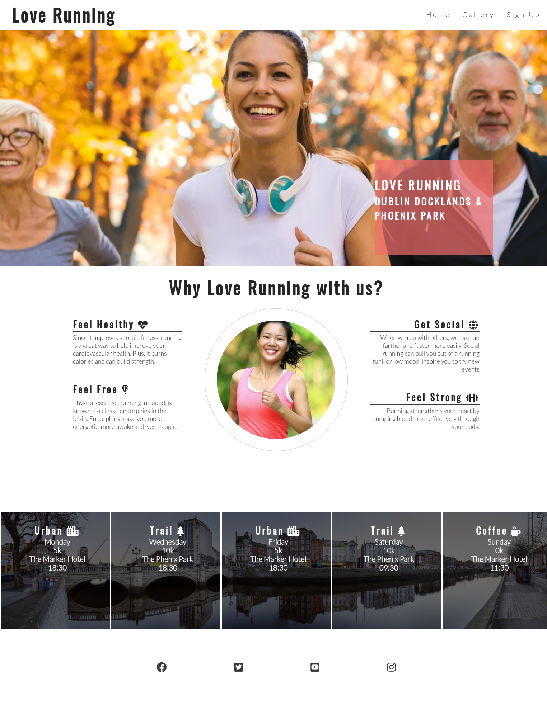
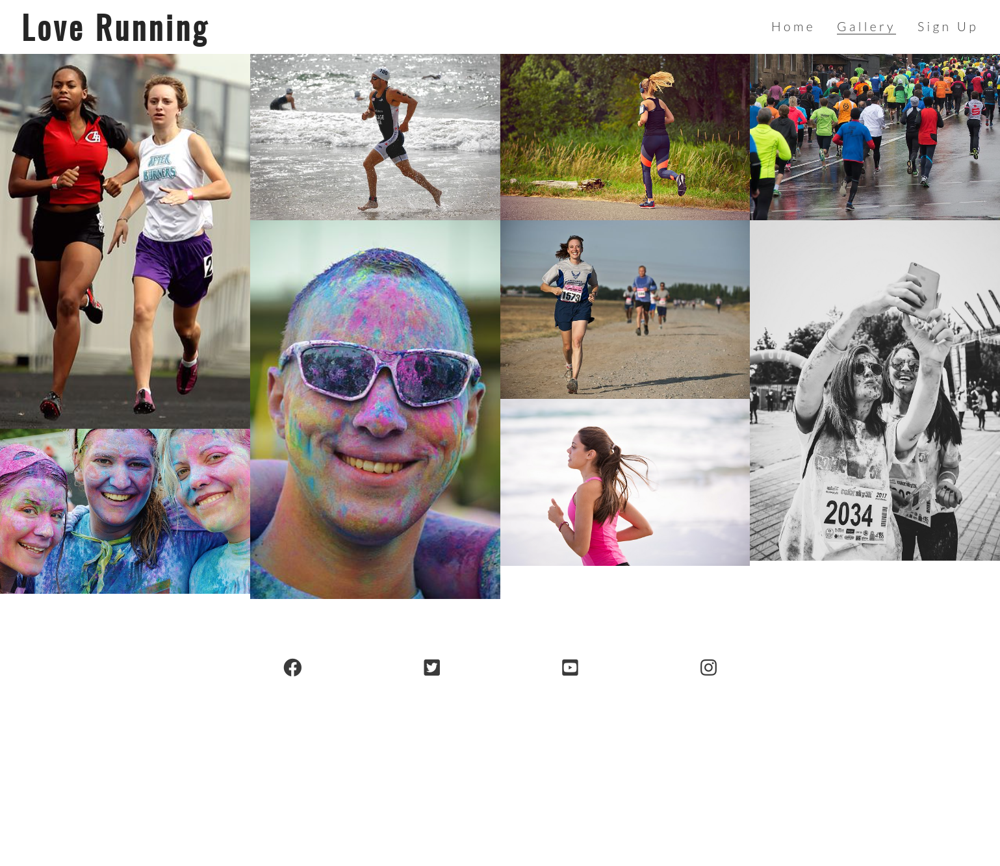
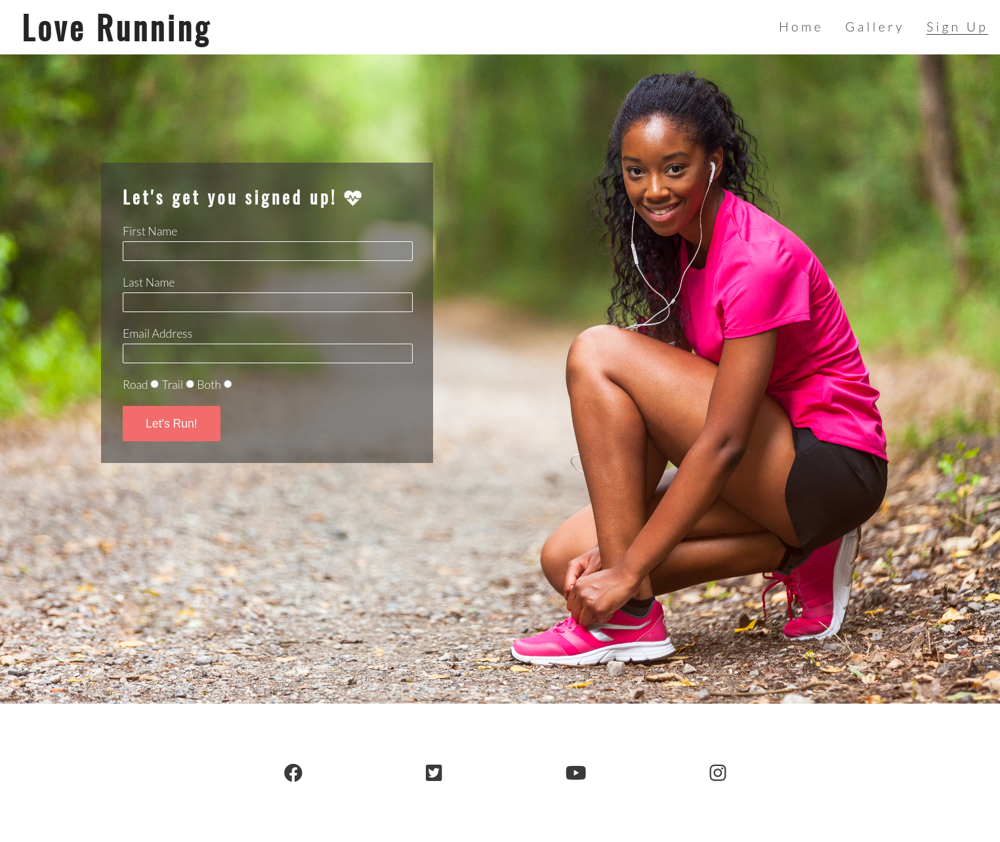

# Love Running
Love Running is an imagine site provided for the local running community. Site contains basic information for runners who want to drop in for a run, or a social meetup at specific time and locations. It contains gallery and provides social links for running community.

# Technologies
* HTML5
* CSS

# Site functionality

##  Index page
* Health and running 
* Meetup times and locations
* Social links

## Gallery
* Virtual wall with community images
* Social links

## Sign Up
* Contains a form to sign up for a trail
* Social links

# Site screenshots

## Index page

## Gallery

## Sign Up

# Demo

You can see the live demo at:

 

https://azelliott.github.io/love-running/index.html

 

# Deployment

To copy the project locally just do:

`git clone https://azelliott.github.io/love-running/index.html`